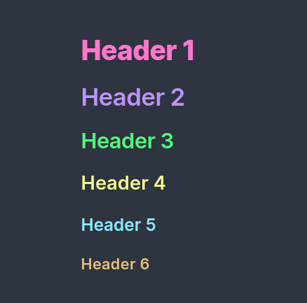
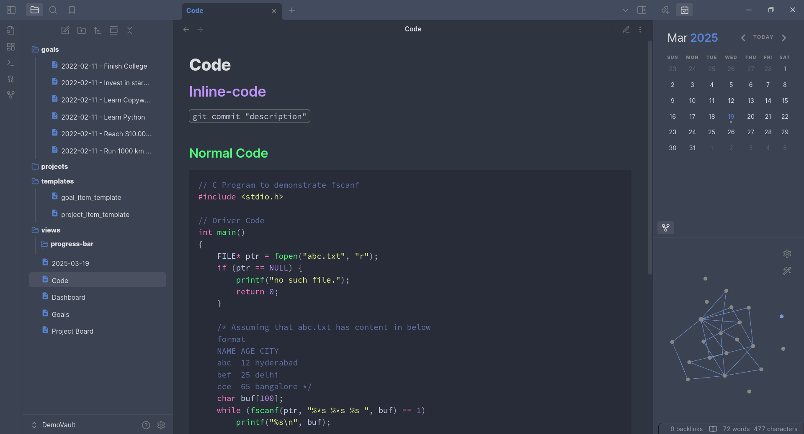
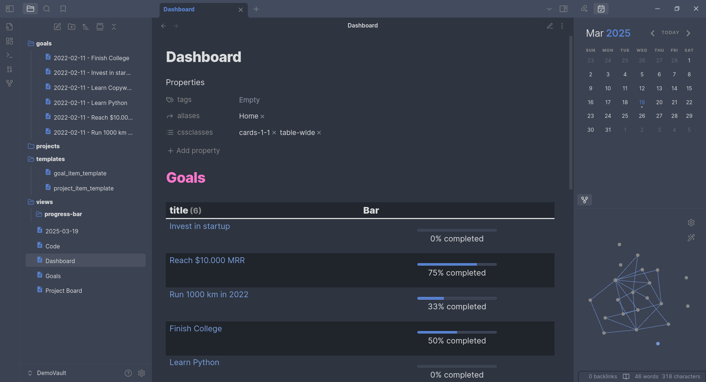

# Dust

A modern theme for Obsidian.

This is a fork of [obsidian-atom](https://github.com/kognise/obsidian-atom) with some changes based on my opinion.

_
 [Vault](https://github.com/chhoumann/DemoVault) with Dataview and Calendar plugins 
_

---

- The codeblock theme is based on [Dracula](https://github.com/dracula/dracula-theme).
- New default accent color.
- Accent color can be changed.
- New folder icon
- Google Material Icon for files
- Graph View lines match the accent color but they're slightly brighter.
- More discrete status bar.
- [Full Calendar Plugin](https://github.com/davish/obsidian-full-calendar) support (the events **will** match your accent color).
- And some other minor changes...

### Donations

| Cryptocurrency      | Address                                                               |
| ------------------- | --------------------------------------------------------------------- |
| **Bitcoin (BTC)**   | `bc1qkhzc3y6lfc4d95rstxmua54x94wa62upkdxslh`                          |
| **Ethereum (ETH)**  | `0x3AEa6512Dc670d775CF819c3078F87d250D34138`                          |
| **Solana (SOL)**    | `DciRFkpahLwf2Uap1A1CHYk7E3zgWZnbUif1w27zTu9r`                        |
| **Kaspa (KAS)**     | `kaspa:qqsgypyqpzvfvuwjwl753nzhrd6y5aw6vycdqncf2hw365jkad7hxd85f0usm` |
| **Base (BASE)**     | `0x3AEa6512Dc670d775CF819c3078F87d250D34138`                          |
| **Polygon (MATIC)** | `0x3AEa6512Dc670d775CF819c3078F87d250D34138`                          |
